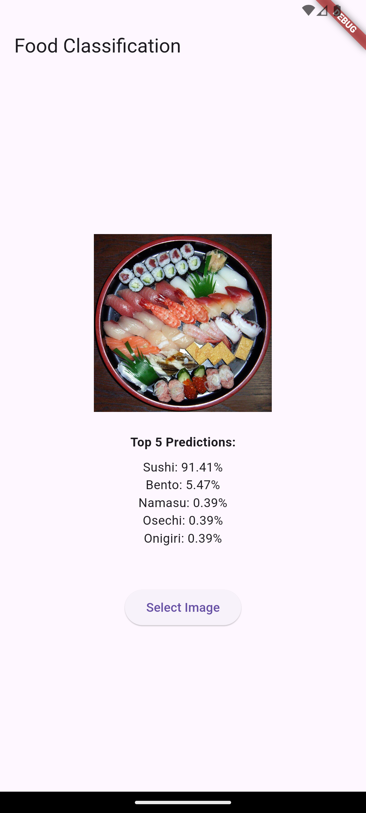
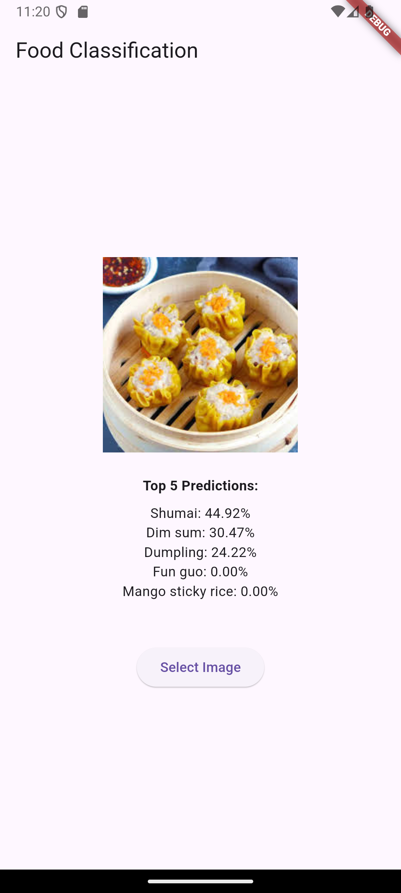
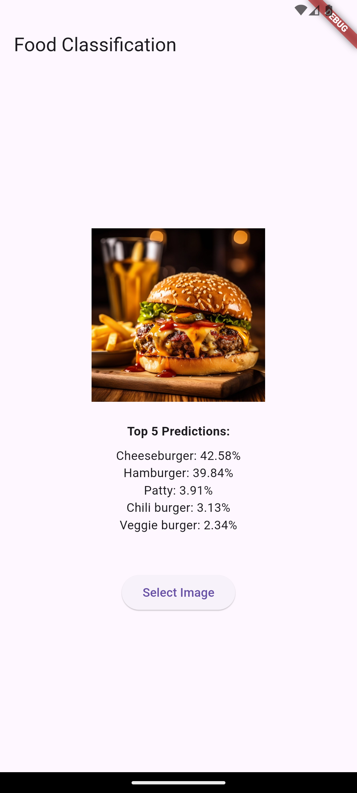

# 🍔 Flutter Food Classification App

A simple food classification mobile application built with Flutter and LiteRT. This app can identify 2024 different types of food items from images with high accuracy.

## 📱 Screenshots

<p float="left">
  
  
  
</p>

## 🚀 Getting Started

### Prerequisites

- Flutter 
- Dart 
- Android Studio / VS Code
- Git

### Installation

1. Clone the repository
```bash
git clone https://github.com/yourusername/food-classification-app.git
```

2. Navigate to project directory
```bash
cd flutter_food_classifier
```

3. Install dependencies
```bash
flutter pub get
```

4. Run the app
```bash
flutter run
```

## 🤖 Model Details

This app uses a TensorFlow Lite model trained on food images, originally based on the model **vision-classifier-food-v1** by **Google** on Kaggle.

## 🙏 Acknowledgments

* Original model from Kaggle: [vision-classifier-food-v1](https://www.kaggle.com/models/google/aiy/tfLite/vision-classifier-food-v1) by [Google](https://www.kaggle.com/organizations/google)
* [LiteRT](https://ai.google.dev/edge/litert)
* [Flutter](https://flutter.dev)
* The amazing Kaggle community for providing high-quality models and datasets
